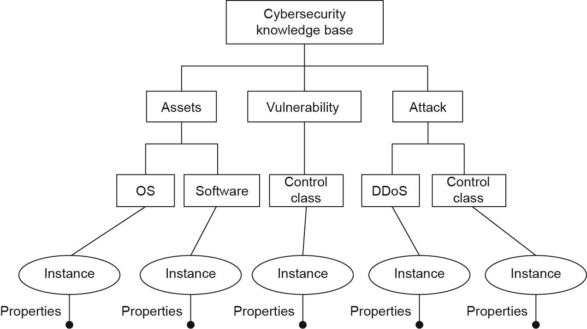
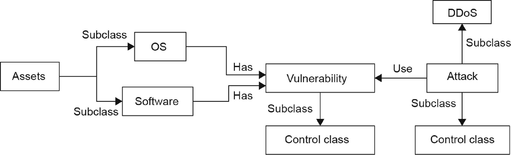

autoparse
=========

The goal is to process logs emitted from various applications and network components, 
and look for patterns that highlight a potential threat or need for further investigation.

The first step is to parse a wide variety of semi-structured logs. While a number of 
standard log formats exist, many are application specific and contain natural language 
messages that have relevant information. The time and cost to develop customer parsers 
is high, which is a constraining factor to mine additional potentially relevant sources
for information.

An automatic approach to parsing log records would open up the range of potentially 
relevant sources to identify threats.

Introduction
------------

Networks are monitored to detect threats and perform analysis once a potential threat is
identified. There are a number of challenges:

1. Network components and applications generate logs in various formats that must be parsed
   for analysis. Outside the standard log formats, there is a constant backlog of work to
   build parsers for new logs.
2. In addition, the parsers generally extract structured information but leave behind relevant
   information in text fields.
3. The extracted entities (and relations) form a natural graph. It would be useful to create
   a graph that can be queries and linked to various external sources such as malware databases,
   blacklisted IP addresses, and so on.

We can use the graph structure to make predictions and perform inference. For example, there
has been recent research using a graph as input to a recurrent neural network (e.g. an LSTM).

Our initial task is:

1. A mechanism to extract entities into a graph representation. The entity types are defined
   in a UDM (Unified Data Model).
2. Data engineering is required to get access to required data and process it in a repeatable
   and automated manner consistent with whatever standards have already been put in the place
   for the project - or help define suitable standards.

High-level Process Flow
-----------------------

1. Read logs from Elasticsearch and publish as a stream.

   1b. (Option) Use Sigma to extract log records of interest from Elasticsearch using rules
       that look for potential threats

2. Parse stream using rules (e.g. regular expressions) and NLP named entity recognition (currently
   using Spacy's out-of-the-box 'en_core_web_sm' model) to identify entities such as an IP address
   in a log line.

3. Process log lines using Spell to identify log keys (a recurring text pattern once you remove
   parameters, either identified in step 2) or from the Spell algorithm as the changing part
   of an otherwise static pattern.

   3b. Anomaly detection given features extracted from logs parsed using Spell

4. Process log keys using NLP (e.g. named entity recognition) to identify any additional entities
   or relations

5. Write entities and relations to the graph database (ArangoDB)

6. Query the graph database for relevant analytics

Documentation
-------------

1. `Design <docs/design.rst>`_
2. `Process <docs/process.rst>`_
3. `Ontology <docs/ontology.rst>`_
4. `Setup <docs/setup.rst>`_
5. `Data Sources <docs/data_sources.rst>`_
6. `Security Information and Event Management (SIEM) information <docs/siem.rst>`_

Cybersecurity Basics
--------------------

Cybersecurity is the set of applying security preventions to provide confidentiality,
integrity, and availability of data. In this section, we explain the well-known triad of
confidentiality, integrity, and availability (CIA) of information security.

**Confidentiality** aims to restrict disclosures and to grant access of information to only the
authorised people. There are various ways of ensuring confidentiality such as encryption,
access controls, and steganography (the practice of concealing a file, message, image, or
video within another file, message, image, or video, e.g. making text the same colour as the
background in word processor documents, e-mails, and forum posts.)

**Integrity** requires protecting data in a consistent, precise, and reliable manner. This has
to guarantee that data is not altered in the course of a specific period. Hashing, digital
signatures, certificates, non-repudiation are the tools and algorithms providing integrity.

**Availability** is another security concept that the data and resources should be available
when people need to access it, particularly during emergencies or disasters. The cybersecurity
specialists should handle the three common challenges for availability; denial of service (DoS),
loss of information system capabilities because of natural disasters and equipment failures
during a normal operation.

Extracting Message Types
------------------------

We can leverage the fact that log messages are generated from code and therefore will 
exhibit a degree a repetition and standardisation of message format. Many automatic log 
parsing approaches focus on extracting message types (aka Log Keys) and their parameters.

The log key of a log entry ``e`` refers to the string constant k from the print statement in
the source code which printed e during the execution of that code. For example, the log 
key ``k`` for log entry ``e = "Took 10 seconds to build instance."`` is ``k = "Took * seconds
to build instance."``, which is the string constant from the print statement
``printf("Took %f seconds to build instance.", t)``. Note that the parameter(s) are abstracted
as asterisk(s) in a log key. We expect the same log key per message type.

This way, we can reduce log files to a smaller set of token structures to train a classifier on.

Values of certain parameters may serve as identifiers for a particular execution sequence, 
such as block_id in a HDFS log and instance_id in an OpenStack log. These identifiers can 
group log entries together or untangle log entries produced by concurrent processes to 
separate, single-thread sequential sequences.

We can use the values of certain parameters to lookup external information, such as whether 
an IP address has been blacklisted.

A common algorithm, with good performance, and which can be applied against a stream that 
may emit new, unseen message type, is *Spell - Streaming Parser for Event Logs using an LCS.*

Spell - Streaming Parser for Event Logs using Longest Common Subsequence
------------------------------------------------------------------------

The Longest Common Subsequence (LCS) algorithm finds the longest common subsequence of 
tokens across log entries. A log message or a log record/entry refers to one line in the log 
file, which is produced by a log printing statement in the source code of a user or kernel 
program running on or inside the system.

The goal is to find message types and separate the message type template from the parameter 
values. For example, a log printing statement: ``printf("Temperature %s exceeds warning threshold\n", tmp);``
may produce several log entries such as: ``"Temperature (41C) exceeds warning threshold"``
where the parameter value is ``"41C"``, and the message type is: ``"Temperature * exceeds warning threshold."``

A structured log parser is to parse log and produce all message types from those m statements. 
The key observation is that, if we view the output by a log printing statement (which is a 
log entry) as a sequence, in most log printing statements, the constant that represents a 
message type often takes a majority part of the sequence and the parameter values take only 
a small portion.

If two log entries are produced by the same log printing statement stat, but only differ by 
having different parameter values, the LCS of the two sequences is very likely to be the 
constant in the code stat, implying a message type.

Spell was designed for a streaming use case, i.e. the LCS sequence of two log messages is 
naturally a message type, which makes streaming log parsing possible.

From Spell, we can derive message templates. We train a model to classify which templates 
are relevant, then use the template as part of a regex to extract structured information.

See `this paper <https://www.cs.utah.edu/~lifeifei/papers/spell.pdf>`_ for more information.

Spell, given for example Kemp logs, will produce structure output as follows:

Sample input:

::

    logger: User bal Timed out (Session : ad512a526c4e19642)
    stats: VSstatus: 0 Total, 0 Up 0 Down 0 Disabled
    stats: RSstatus: 0 Total, 0 Up 0 Down 0 Disabled
    stats: SubVSstatus: 0 Total, 0 Up 0 Down 0 Disabled
    login[25288]: pam_unix(login:auth): check pass; user unknown
    login[25288]: pam_unix(login:auth): authentication failure; logname=LOGIN uid=0 euid=0 tty=/dev/tty1 ruser= rhost=
    login[25288]: FAILED LOGIN (1) on '/dev/tty1' FOR 'UNKNOWN', Authentication failure

Structured output:

::

    LineId,Process,Content,EventId,EventTemplate,Parameters
    20,logger,User bal Timed out (Session : ad512a526c4e19642),b72d970b,User <*> Timed out (Session : <*>,"[""bal"",""ad512a526c4e19642""]"
    21,stats,"VSstatus: 0 Total, 0 Up 0 Down 0 Disabled",dc8c71e4,"VSstatus: <*> Total, <*> Up <*> Down 0 Disabled","[0,0,0]"
    22,stats,"RSstatus: 0 Total, 0 Up 0 Down 0 Disabled",a3b39f5c,"RSstatus: <*> Total, <*> Up <*> Down 0 Disabled","[0,0,0]"
    23,stats,"SubVSstatus: 0 Total, 0 Up 0 Down 0 Disabled",3f401b6e,"SubVSstatus: 0 Total, 0 Up 0 Down 0 Disabled","[0,0,0]"
    24,login[25288],pam_unix(login:auth): check pass; user unknown,cc6f52d7,pam_unix(login:auth): check pass; user unknown,"[]"
    25,login[25288],pam_unix(login:auth): authentication failure; logname=LOGIN uid=0 euid=0 tty=/dev/tty1 ruser= rhost=,88abdb22,pam_unix(login:auth): authentication failure; logname=LOGIN uid=0 euid=0 tty=<*> ruser= rhost=,"[""/dev/tty1""]"
    26,login[25288],"FAILED LOGIN (1) on '/dev/tty1' FOR 'UNKNOWN', Authentication failure",83a09411,"FAILED LOGIN (1) on '<*>' FOR 'UNKNOWN', Authentication failure","[1]"

Event templates:

::

    EventId,EventTemplate,Occurrences
    b72d970b,User <*> Timed out (Session : <*>,11
    dc8c71e4,"VSstatus: <*> Total, <*> Up <*> Down 0 Disabled",14
    a3b39f5c,"RSstatus: <*> Total, <*> Up <*> Down 0 Disabled",13
    3f401b6e,"SubVSstatus: 0 Total, 0 Up 0 Down 0 Disabled",10
    cc6f52d7,pam_unix(login:auth): check pass; user unknown,2
    88abdb22,pam_unix(login:auth): authentication failure; logname=LOGIN uid=0 euid=0 tty=<*> ruser= rhost=,2
    83a09411,"FAILED LOGIN (1) on '<*>' FOR 'UNKNOWN', Authentication failure",2

The set of event templates will be much smaller than the set of log records. We can apply
NER against the set of event templates, construct a knowledge graph of entity, referenced
to template (event_id) and log record (log_id), and reference lookup information for
parameter values (e.g. whether an IP address appears in a blacklist site).

Given the performance (and cost) overhead of looking up information with external services,
the lookups will be delayed. A downstream analytic process will flag clusters of interest and
perform lookups for only those nodes.

TODO: From initial tests, Spell works pretty well out of the box. However, I'm getting slightly
better results from a paper published the following year (2017) - Drain.

See Drain: An Online Log Parsing Approach with Fixed Depth Tree, Proceedings of the 24th
International Conference on Web Services (ICWS), 2017. (http://jmzhu.logpai.com/pub/pjhe_icws2017.pdf)

Knowledge Graph
---------------

Entities and links are add to a graph data structure for downstream analysis. A graph starts with
defining an ontology. (Although I would expect definitions and structure to evolve, up-front analysis
solves a number of early critical design decisions. For example, we expect the graph size to grow
(given the expected log volume) to require a clustered database environment. Understanding the schema
and access patterns will establish the appropriate partitioning key and secondary indexes for the
graph implementation.

Examples of ontologies is shown below.

.. image:: images/cysec_knowledge_graph.jpg

The example ontology shown above, consists of the following five entity types:

1. Vulnerability. Each of the records in the vulnerability database corresponds to an instance
   of a vulnerability type. Every vulnerability has its own unique CVE ID.
2. Assets. The assets include the software and the operating system (OS).
3. Software. This is a subclass-of assets (e.g., Adobe Reader).
4. OS. This is a subclass of assets (e.g., Ubuntu 14.04).
5. Attack. Most attacks can be regarded as an intrusion aimed at a certain vulnerability. The
   process of an attack can be a process of vulnerability exploitation.

See the paper, `A Practical Approach to Constructing a Knowledge Graph for Cybersecurity -
ScienceDirect <https://www.sciencedirect.com/science/article/pii/S2095809918301097>`_, for more information.
